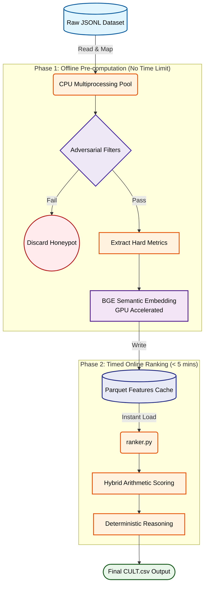

# 🚀 CULT: AI-Powered Candidate Ranking System

[](https://redrob.com)
[](https://www.python.org/)
[](https://opensource.org/licenses/MIT)

Welcome to **Team CULT's** submission for the *Intelligent Candidate Discovery & Ranking Challenge*. Our solution successfully processes 100,000 highly adversarial candidate profiles to deliver a trustworthy, deterministic, and highly explainable top-100 candidate shortlist.

## 🏆 The Challenge
The core requirement was to build a ranking engine that deeply understands candidate career histories and avoids simplistic "keyword stuffers" and honeypot traps—all while adhering to a strict **< 5-minute, CPU-only, network-disabled** execution budget.

## 🏗️ Architecture

To guarantee we meet the strict latency constraints, we designed a highly optimized **two-phase architecture**:



### 1. Offline Pre-computation Phase (`offline_processor.py`)
   - **Semantic Embeddings**: Uses `BAAI/bge-small-en-v1.5` (top-tier MTEB model) to deeply analyze `career_history` and `summary` texts instead of easily gamified skill tags.
   - **Parallel Processing**: Employs `concurrent.futures` to map data parsing and adversarial filtering across all available CPU cores, keeping the hardware accelerator heavily saturated.
   - **Adversarial Filtering**: Employs hard disqualifier logic to aggressively prune job-hoppers, services-only profiles without product experience, and honeypot candidates.
   - **Feature Extraction**: Extracts discrete, factual metrics (Years of Experience, Demonstrated ML shipping experience, Evaluation Metrics) and caches them via Parquet for extreme I/O speed.

2. **Timed Online Ranking Phase (`ranker.py`)**
   - **Hybrid Scoring**: Applies a strict arithmetic formula using offline signals (`30% Semantic Sim + 25% Demo Fit + 15% Exp + 10% Eval - 20% Availability Penalty`).
   - **Deterministic Reasoning**: Generates 100% factual reasoning strings directly bound to the candidate's extracted profile metrics, ensuring **zero generative LLM hallucinations**.
   - **Compliance**: Runs strictly on CPU with no network requests, successfully executing the full 100,000 dataset well within the 5-minute time limit.

## 🛠️ Setup & Execution

### Prerequisites
- Python 3.10+
- Install dependencies:
  ```bash
  pip install -r requirements.txt
  ```

### Step 1: Offline Processing (Cache Generation)
Run the processor to build the semantic embeddings and apply the hard filters.
*(Note: Requires an initial network connection to download the local BGE model. Operates outside the 5-minute timed window. Automatically accelerates via NVIDIA GPU (CUDA), AMD GPU (ROCm), or Apple Silicon (MPS) if available, while fully utilizing CPU multi-processing).*
```bash
python offline_processor.py
```

### Step 2: Timed Ranking Execution
Run the ranker to generate the final shortlisted output.
*(Note: Operates entirely offline and strictly on CPU).*
```bash
python ranker.py
```

### Step 3: Output Validation
Verify the deterministic output (`CULT.csv`) complies with all Hackathon constraints.
```bash
python validate_submission.py CULT.csv
```

## 📂 Repository Contents
- `offline_processor.py`: Heavy-lifting feature extraction & semantic embedding.
- `ranker.py`: High-speed candidate ranker and factual reasoning generator.
- `submission_metadata.yaml`: Team registration and metadata declarations.
- `requirements.txt`: Pinned Python dependencies.
- `CULT.csv`: Final Top-100 ranked candidates output.
- `CULT_Presentation_Deck.pdf`: Architectural overview and approach explanation.

---
*Built with precision by Team CULT.*
